# First partial

# Creamos la estructura del proyecto con maven y Spring boot


# Diseño
Para el diseño se contemplara la implementación de el patrón TDD y el patrón observer. Esto con el objetivo de hacer que los dos agentes implementen la interfaz StockObserver y estén atentos a la actualización que occure en ProdcutManager con respecto a las modificaciónes de stock.

### Patrón observer - elegido
Se eligió este patrón dado que el requerimiento funcional nos exige implementar dos agentes que esten a la espera de los cambios que acontecen en el stock. 

Este patrón se amolda a la perfección dado que podemos crear una interfaz que contenga el método core de la actualización, que en este caso será update, de acuerdo a el update que ocurra en ProductManager, cada uno de los agentes que se crearan como clases independientes, hará override de update, dado  que ambos implementan la interfaz StockObserver y harán lo que cada uno debe hacer. 

### Inyección de dependecias. 
La inyección se resolvio añadiendo @Component a las clases que las necesitaban con Spring boot, ademas que los métodos reciben por inyección las dependendias que necesitan.  

Como por ejemplo, si ProductManager necesita un producto, lo recibe como dependencia mediante inyección. 


# Implementamos TDD para el desarrollo de la app. 

1. Dado que ya tenemos el diseño, implementamos las clases espejo test y a cada una vamos a crear el código mínimo de pruebas unitarias para que la prueba falle de acuerdo a TDD. 

## First enough test code fail the test

* LogAgent


* WarningAgent


* Product


* ProductManager


* ProductApplication
En este caso, dado que esta es la capa de interacción con el cliente, no la testeamos.

* StockObserver
Al ser una interfaz, no la testeamos

Al compilar, no hay problema


Pero al revisar los tests, veremos que no corren


# Now, production code to pass the test

* StockObserver


* Product

* WarningAgent

* LogAgent

* ProductManager


* ProductApplication


Ahora, si compilamos, todo estará ok 


Y cuando ejecutemos la pruebas, ahora si pasarán.
 

Ahora vamos a configurar el Pom.xml para poder utilizar Jacoco y poder ver el estado actual de la cobertura. 


Hamemos un maven clean package

Como nos dimos cuenta, las pruebas aún no cumplen lo requerido
 Hacemos mvn clean test para generar el site de jacoco

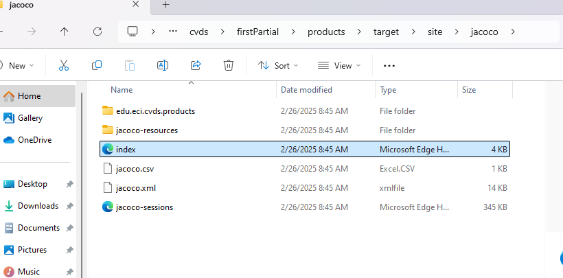
 
 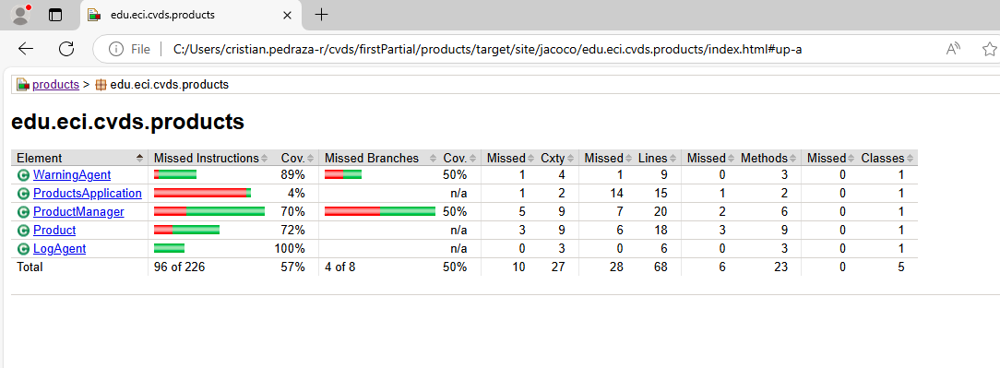


### Refactor the test 
Ahora, refactorizamos las pruebas para poder hacer el cubrimiento requerido en los requerimientos.

Por poder terminar el parcial en su totalidad, el refactor de todas las pruebas queda en la versión definitiva del proyecto. 

Ahora volvemos a ejecutar mvn clean package, mvn clean test, generamos el reporte con Jacoco y nos daremos cuenta que la cobertura supera ampliamente la requerida. En este caso tenemos una  cobertura buena.
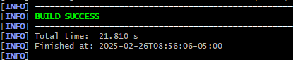
Despues del refactor las pruebas pasan
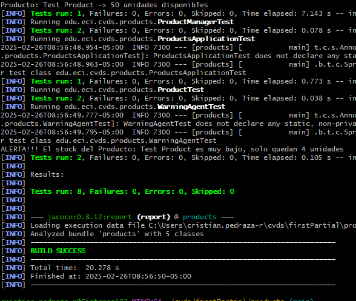

Cobertura nueva
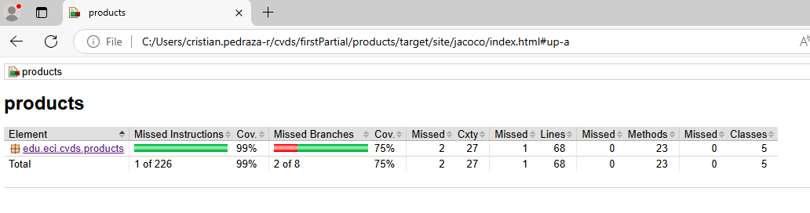
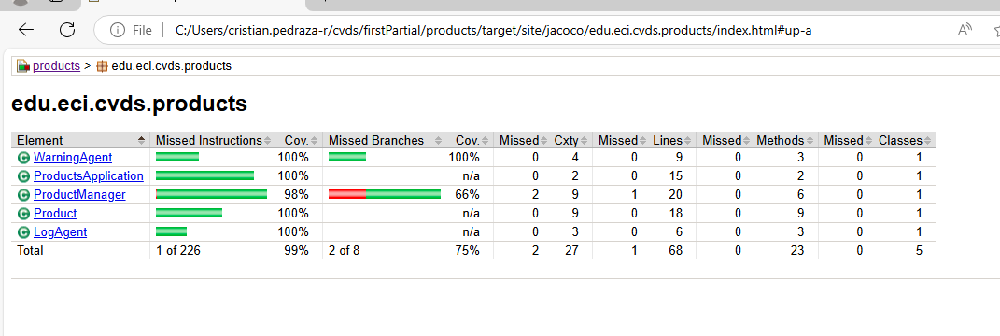


# Bono
Dado que el profe ya había dicho, ya había credo cuenta con github en sonarcloud. Asi que nos registramos. 


Hacemos nuestro repo publico. 

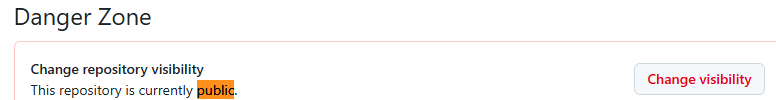

Nos loggeamos en sonarcloud
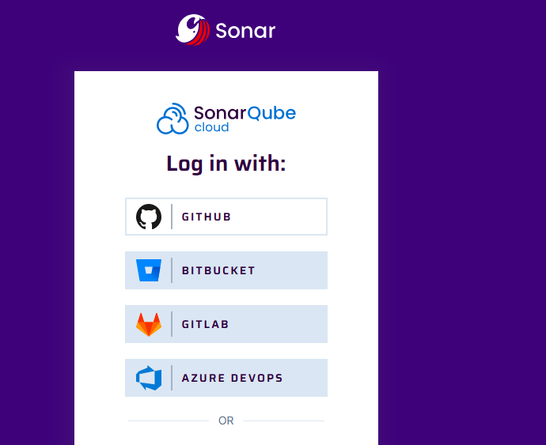

Creamos una nueva organización
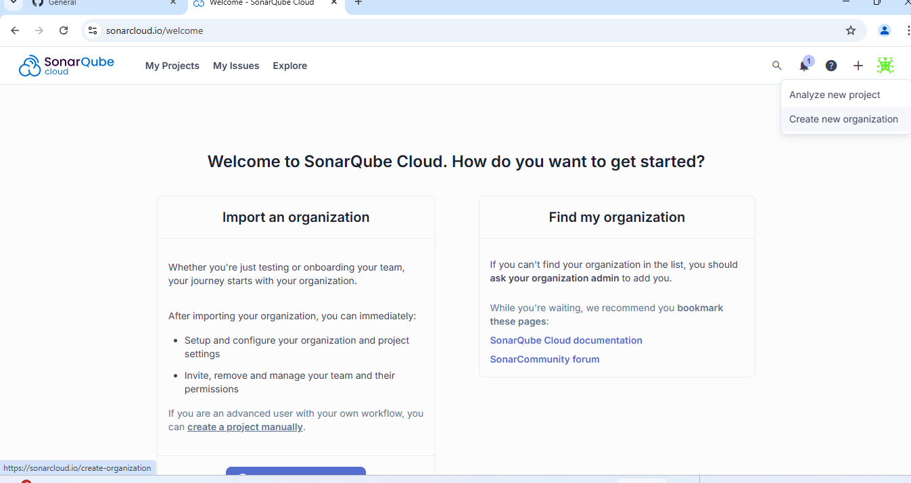
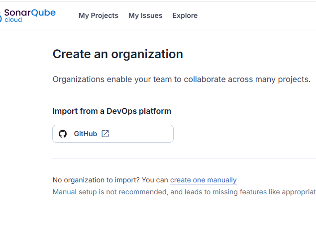
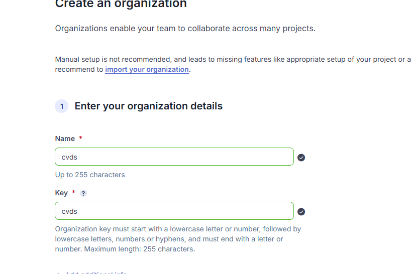
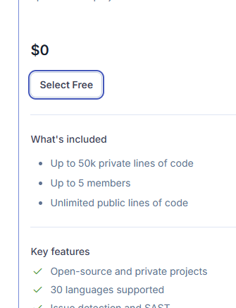

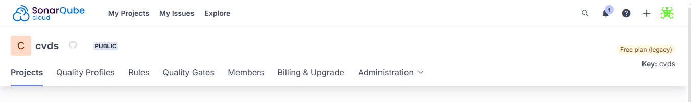

Creamos un toke de seguridad

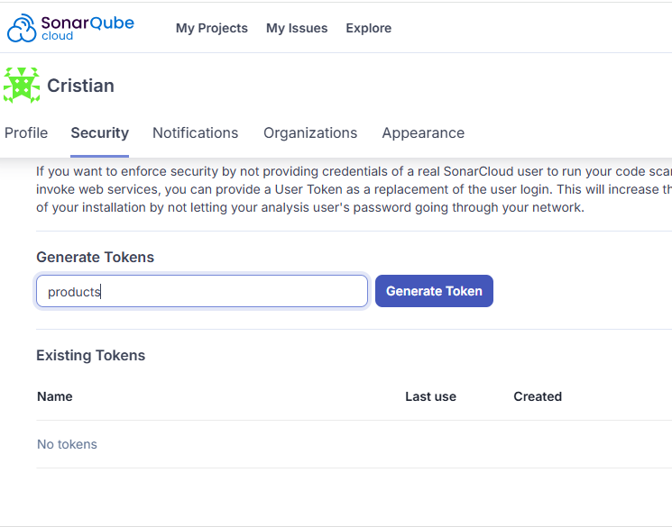


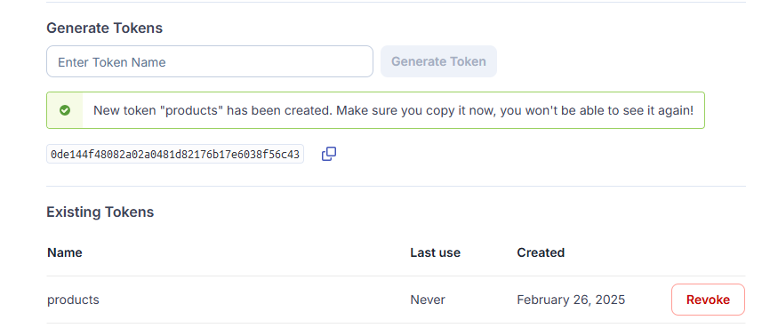

Ejecutamos el comando de configuración en mvn para añadir el proyecto en donde tenemos que decir
* El origen que es sonnarcloud
* la organización
* la organization key
* y el token
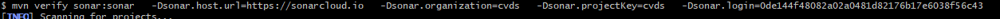
Y listo

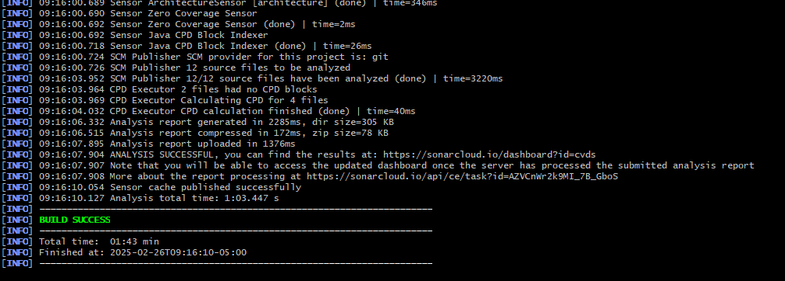
Como se puede ver, en sonarcloud se muestra la cobertura que la que había mostrado Jacoco.

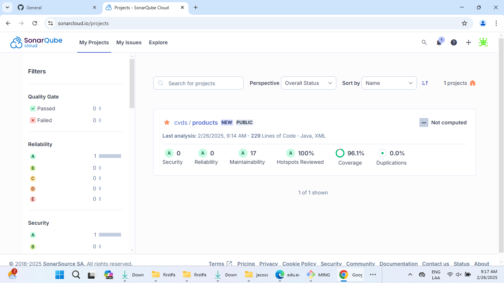
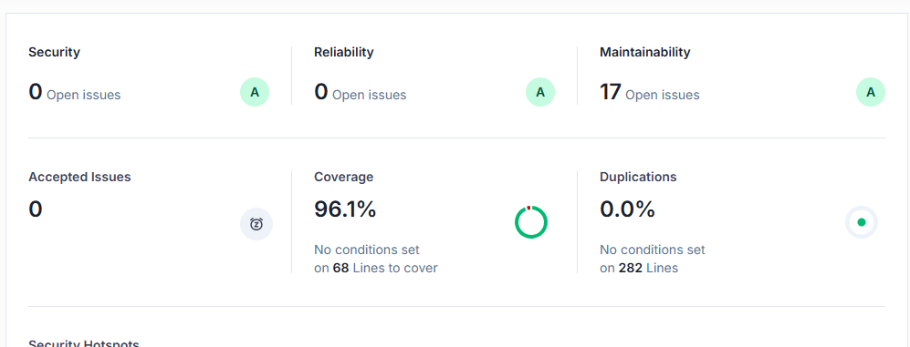
# Cómo ejecutar la app
La app tiene un desarrollo bastante influencia a los servcios, como se nos enseñó. Por ello, la clase controladora es ProductsApplication, allí se hizo en la main la prueba de aceptación. 

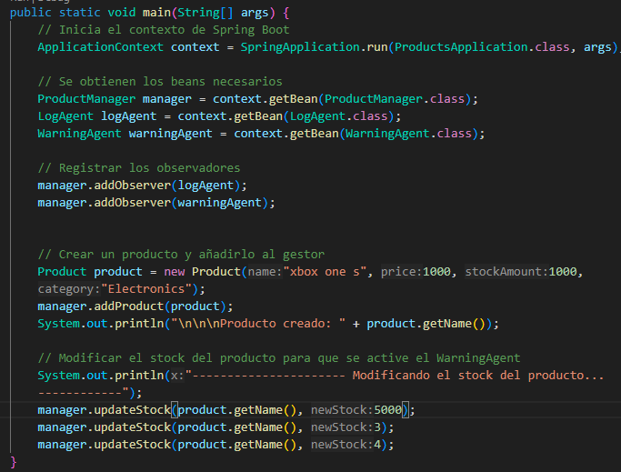

Y los resultados, como indica el requerimiento, se muestra en consola de acuerdo a lo que debe pasar. Este enfoque permite desarrolla los controladores rest y conectar un cliente front. 

Para ejecutar solo se necesita escribir 
```bash
spring-boot:run
```

En la raíz del proyecto. 

Al ejecutar, queda así

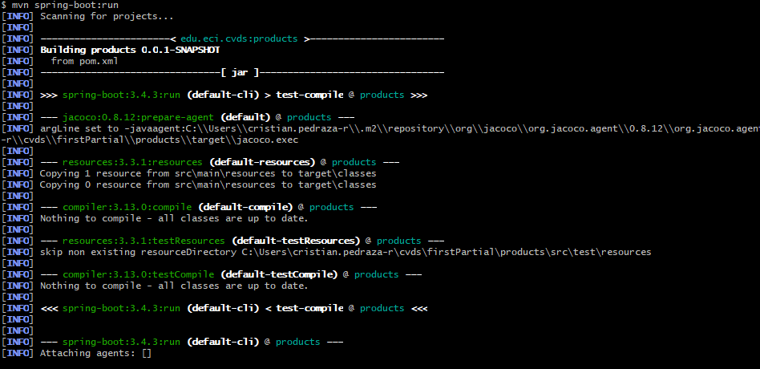
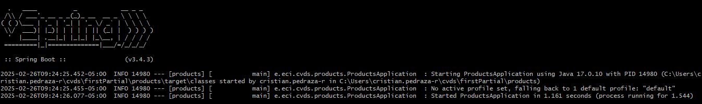
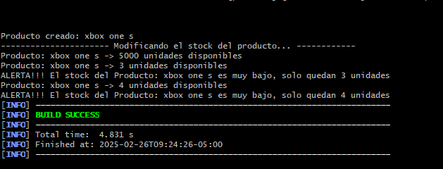

