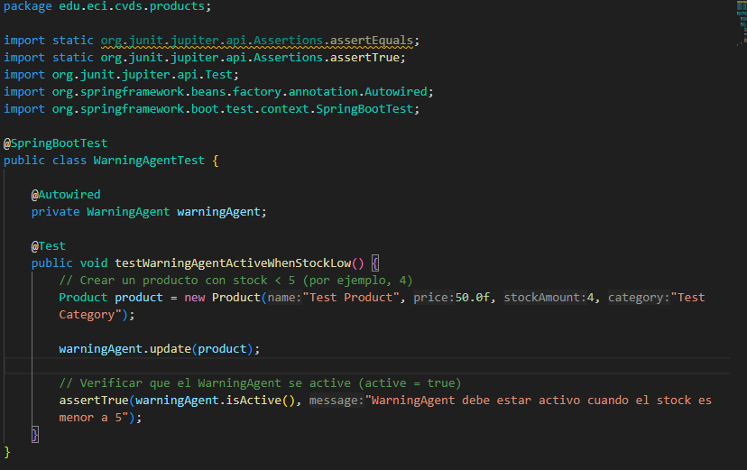

# First partial

# Creamos la estructura del proyecto con maven y Spring boot

# Diseño
Para el diseño se contemplara la implementación de el patrón TDD y el patrón observer. Esto con el objetivo de hacer que los dos agentes implementen la interfaz StockObserver y estén atentos a la actualización que occure en ProdcutManager con respecto a las modificaciónes de stock.

# Implementamos TDD para el desarrollo de la app. 

1. Dado que ya tenemos el diseño, implementamos las clases espejo test y a cada una vamos a crear el código mínimo de pruebas unitarias para que la prueba falle de acuerdo a TDD. 

## First enough test code

* LogAgent

* WarningAgent

* Product

* ProductManager

* ProductApplication
En este caso, dado que esta es la capa de interacción con el cliente, no la testeamos.

* StockObserver
Al ser una interfaz, no la testeamos

Al compilar, no hay problema

Pero al revisar los tests, veremos que no corren

# Now, production code to pass the test

